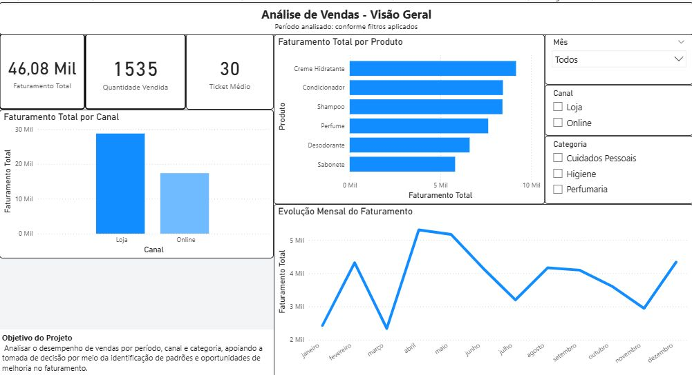

# 📊 Análise de Vendas com Power BI

Projeto de análise de dados desenvolvido com Power BI, com foco em transformar dados de vendas em insights claros para apoio à tomada de decisão.

## 🎯 Objetivo
Analisar o desempenho de vendas por período, canal e categoria, identificando padrões, tendências e oportunidades de melhoria no faturamento.

## 🛠️ Ferramentas Utilizadas
- Power BI
- Excel
- Modelagem de dados
- Análise exploratória de dados

## 📊 Principais Métricas
- Faturamento total
- Quantidade vendida
- Ticket médio
- Faturamento por produto
- Faturamento por canal
- Evolução mensal do faturamento

## 🔎 Principais Insights
- O canal **Loja** representa aproximadamente **62% do faturamento total**.
- Os produtos **Creme Hidratante, Condicionador e Shampoo** concentram a maior parte da receita.
- Há um pico de faturamento nos meses de **abril e maio**, indicando possível sazonalidade.
- Alguns meses apresentam queda no desempenho, sugerindo oportunidades para ações comerciais.

## 📁 Estrutura do Projeto

analise-vendas-powerbi/
├── dashboard/
│ └── analise_vendas_powerbi.pbix
├── dados/
│ └── vendas_projeto.xlsx
├── imagens/
│ └── dashboard_visao_geral.png
└── README.md

## 📌 Observação
Projeto desenvolvido para fins de estudo e portfólio, simulando um cenário real de análise de dados no varejo.

